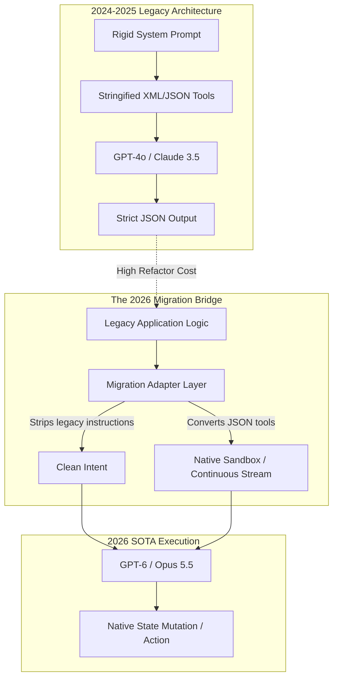

# 04. Managing Legacy Transitions: Migrating from GPT-4o & Claude 3.5

## The Migration Pipeline



## The Problem: The "Over-Prompting" Regression

By September 2026, GPT-4o had been officially retired from mainstream usage, and Claude 3.5 was rapidly depreciating in favor of the 5.5 family. Organizations rushed to update their codebases.

However, a massive problem emerged: **Over-Prompting Regression**. 
In 2024, AI Engineers had to "hand-hold" models. System prompts were littered with instructions like:
*   *"You must output strict JSON."*
*   *"Wrap your tool calls in `<tool></tool>` XML tags."*
*   *"Think step by step in `<scratchpad>`."*

When engineers simply swapped the API key to point to **GPT-6** or **Opus 5.5**, performance actually *dropped*. These 2026 models are trained for native environment grounding and continuous streams. When fed legacy JSON/XML constraints, the models attempted to simulate being a legacy model, severely restricting their own reasoning capabilities and breaking native orchestration patterns.

## The Solution: The Migration Adapter Pattern

You cannot simply search-and-replace API endpoints. You must implement a **Migration Adapter Layer**. 

This layer intercepts legacy requests, strips out archaic prompting constraints (like JSON formatting requests), translates legacy tool arrays into 2026 Native Sandbox bindings, and maps the model's native state mutations back into the JSON format that the rest of your legacy application expects.

This allows organizations to immediately benefit from the intelligence of GPT-6/Opus 5.5 without needing to rewrite millions of lines of legacy application code overnight.

## Implementation: Building the Migration Bridge

Let's look at how to build these adapters to safely upgrade production systems.

### Python: Upgrading Claude 3.5 XML to Opus 5.5 Native

In Python, we'll build an adapter that takes a legacy Claude 3.5 tool-use request and maps it to an Opus 5.5 Native Sandbox.

```python
import json
# Simulated SDKs
from legacy_anthropic import Claude35Client # The old 2024 way
from anthropic_native import OpusClient, EphemeralSandbox # The new 2026 way

class ClaudeMigrationAdapter:
    """
    Acts as a drop-in replacement for the legacy Claude35Client.
    It accepts legacy requests, translates them to Opus 5.5 native execution,
    and returns a legacy-compatible JSON response.
    """
    def __init__(self):
        # Initialize the 2026 Opus model
        self.modern_client = OpusClient(model="claude-opus-5.5")
        
    def execute_legacy_request(self, system_prompt: str, user_prompt: str, legacy_tools: list) -> dict:
        # 1. Clean the Prompts (Anti-Over-Prompting)
        # We must strip out instructions forcing the model into legacy formats.
        cleaned_system = system_prompt.replace("You must use the provided tools and output XML.", "")
        
        # 2. Translate Tools to a Native Sandbox
        # In 2024, we passed JSON schemas of tools. In 2026, we spin up a sandbox
        # and expose the underlying functions natively.
        sandbox = EphemeralSandbox()
        
        for tool in legacy_tools:
            # Map the legacy JSON schema to a native callable function in the sandbox
            # (In a real app, this dynamically binds the underlying Python functions)
            sandbox.register_native_binding(tool['name'], tool['schema'])
            
        # 3. Bind and Execute
        session = self.modern_client.bind_environment(sandbox)
        
        # Opus 5.5 executes the task using native awareness, ignoring the old XML structures
        result = session.execute_mission(f"{cleaned_system}\n\n{user_prompt}")
        
        # 4. Bridge the Response Back
        # The legacy application expects a strict JSON string mapping to a tool call.
        # We parse the sandbox's final state and mock a legacy response.
        if result.success:
            # Reconstruct what the legacy app expects based on what Opus 5.5 actually did
            mocked_legacy_response = {
                "tool_called": result.primary_action_taken,
                "parameters_used": result.state_delta.extract_parameters(),
                "status": "success"
            }
            return mocked_legacy_response
        else:
            raise Exception(f"Modern execution failed: {result.failure_reason}")

# Usage: The rest of your 2024 application doesn't know the architecture changed
adapter = ClaudeMigrationAdapter()
response = adapter.execute_legacy_request(
    system_prompt="You are a helpful assistant. You must use the provided tools and output XML.",
    user_prompt="Check the weather in Tokyo.",
    legacy_tools=[{"name": "get_weather", "schema": "{...}"}]
)
print(response) # Returns legacy JSON, generated via 2026 native orchestration
```

### TypeScript: Bridging GPT-4o REST to GPT-6 Streams

In TypeScript, we migrate a legacy blocking HTTP request (GPT-4o) into the new continuous asynchronous prefill (GPT-6), while keeping the function signature identical for the caller.

```typescript
// Simulated SDKs
import { GPT4oRESTClient } from '@openai/legacy-sdk';
import { AstraContinuousClient, StreamEventType } from '@openai/gpt6-sdk';

export class GPT6MigrationAdapter {
    private astraClient: AstraContinuousClient;

    constructor() {
        // Initialize the 2026 Astra model
        this.astraClient = new AstraContinuousClient({ model: 'gpt-6-astra' });
    }

    /**
     * This method signature perfectly matches the old GPT-4o SDK.
     * The legacy app calls this, unaware that under the hood, we are 
     * utilizing a continuous WebTransport stream.
     */
    async createChatCompletion(messages: any[], tools: any[]): Promise<any> {
        
        // 1. Establish the modern continuous channel
        const channel = await this.astraClient.connectContinuousChannel();
        
        // 2. Translate legacy message array into the continuous stream
        // Instead of sending one massive payload, we stream the context in.
        for (const msg of messages) {
            // Strip out toxic legacy prompts
            const cleanContent = msg.content.replace(/Respond strictly in JSON format/g, '');
            await channel.pushContext({ role: msg.role, data: cleanContent });
        }
        
        // 3. Initiate the decode phase
        await channel.sendPrompt("Execute the requested task natively.");
        
        let accumulatedText = "";
        
        // 4. Consume the stream (blocking the legacy caller, as they expect synchronous return)
        for await (const chunk of channel.receiveStream()) {
            if (chunk.type === StreamEventType.TEXT_DELTA) {
                accumulatedText += chunk.content;
            } else if (chunk.type === StreamEventType.DONE) {
                break;
            }
        }
        
        // 5. Mock the legacy GPT-4o response object
        return {
            id: `chatcmpl-migrated-${Date.now()}`,
            object: "chat.completion",
            created: Math.floor(Date.now() / 1000),
            model: "gpt-6-astra-legacy-bridge",
            choices: [
                {
                    index: 0,
                    message: {
                        role: "assistant",
                        content: accumulatedText,
                        // If tools were used, bridge the native execution state back to tool_calls array
                        tool_calls: channel.extractLegacyToolCalls(tools) 
                    },
                    finish_reason: "stop"
                }
            ]
        };
    }
}

// Legacy application code remains untouched:
async function legacyAppLogic() {
    const ai = new GPT6MigrationAdapter(); // Was: new GPT4oRESTClient()
    
    const response = await ai.createChatCompletion(
        [{ role: 'user', content: 'Extract the data. Respond strictly in JSON format.' }],
        []
    );
    
    console.log(response.choices[0].message.content);
}

legacyAppLogic();
```

### Rust & Julia: The Core Concept

In **Rust** and **Julia**, the migration principle is identical. 
1.  **Intercept** the legacy struct or struct instantiation.
2.  **Sanitize** the input data, stripping out 2024/2025 formatting hacks.
3.  **Translate** the payload into the modern format (Continuous Stream or Native Sandbox).
4.  **Execute** using the 2026 SDK.
5.  **Re-serialize** the output back into the legacy structs (e.g., matching the old Serde JSON structs in Rust) so the rest of the compiled application doesn't require a massive rewrite. 

By applying this Adapter Pattern, teams can upgrade their underlying intelligence engines in a matter of days, buying them time to systematically refactor the application layer to fully embrace the 2026 SOTA architecture over the following months.
