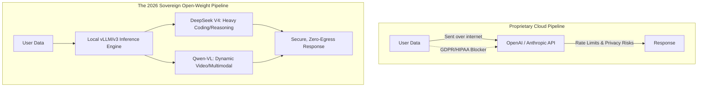

# 05. DeepSeek & Qwen: The 2026 Open-Weight Frontier

## Sovereign AI Architecture



## The Problem: Vendor Lock-in and Data Sovereignty

As agentic systems moved from prototypes to mission-critical enterprise infrastructure in 2024 and 2025, a stark reality set in. Pushing terabytes of proprietary codebases, internal financial documents, and sensitive customer data to closed-API providers (OpenAI, Anthropic, Google) presented massive risks.

*   **Compliance Blockers**: Strict regulations like GDPR, HIPAA, and the EU AI Act made it illegal for many institutions to stream raw data to external servers.
*   **Vendor Lock-in & Rate Limits**: Relying entirely on a single provider meant businesses were at the mercy of unexpected API rate limits, pricing changes, or model deprecations (such as the sudden phasing out of GPT-4o).

In the past, the counter-argument was performance: open-source models just weren't smart enough.

## The Solution: The 2026 DeepSeek and Qwen Epoch

By September 2026, the landscape fundamentally shifted. The open-weight ecosystem, led by the latest iterations of **DeepSeek** and **Qwen**, decisively breached the frontier barrier, matching and in some tasks exceeding the performance of proprietary models.

*   **DeepSeek (V4 Architecture)**: Mastered **Native Sparse Attention (NSA)** and **DualPipe Parallelism**. It operates as the preeminent open-weight coding and math reasoning model, capable of complex multi-step software engineering on local clusters.
*   **Qwen (Latest VL Family)**: Dominates the multimodal space. It introduced **Dynamic-FPS Video processing** natively, allowing edge devices and internal servers to process continuous video streams with unparalleled efficiency.

AI Engineers now build **Sovereign AI Pipelines**, where these models are hosted entirely on internal infrastructure (or secure VPCs), providing zero-egress data privacy and infinite scaling without API rate limits.

## Implementation: Serving and Consuming Sovereign Models

To utilize the open-weight frontier, an AI Engineer must know how to serve the models locally and query them. We will use the 2026 equivalent of advanced inference engines (like modern `vLLM`) to demonstrate this.

### Python: Serving DeepSeek on a Local Cluster

In Python, we act as the ML Ops engineer, spinning up the DeepSeek model on a local GPU cluster utilizing Native Sparse Attention.

```python
# Simulated 2026 vLLM-Next Engine
from vllm_next import LLMEngine, EngineArgs

def initialize_sovereign_server():
    print("[Server] Booting DeepSeek V4 on local infrastructure...")
    
    # 1. Configure the inference engine for DeepSeek's specific architecture
    engine_args = EngineArgs(
        model="deepseek-ai/deepseek-coder-v4",
        # Enable 2026 Native Sparse Attention to handle massive context locally
        enable_nsa=True, 
        # Utilize 8-bit or 4-bit quantization (like FP8) to fit 
        # frontier weights onto enterprise-grade GPUs (e.g., H100s / B200s)
        quantization="fp8",
        # Enforce tensor parallelism across 4 local GPUs
        tensor_parallel_size=4 
    )
    
    # 2. Initialize the highly optimized engine
    engine = LLMEngine.from_engine_args(engine_args)
    
    print("[Server] Model loaded. Ready for sovereign inference.")
    
    # 3. Expose the engine via a local API (simulated)
    # In production, this would be wrapped in a FastAPI server compliant with OpenAI's API format
    # allowing legacy apps to just point their base_url to "localhost:8000"
    while True:
        request = wait_for_internal_request()
        
        # Process the request entirely locally. No data leaves the corporate network.
        response = engine.generate(request.prompt)
        send_internal_response(request.id, response)

if __name__ == "__main__":
    # Note: This is pseudo-code for the serving loop. 
    pass
```

### TypeScript: Consuming the Sovereign Multimodal Model (Qwen)

From the application layer (TypeScript), we interact with our self-hosted Qwen model just as we would a cloud API, but we can stream massive amounts of internal video data without worrying about bandwidth costs or privacy.

```typescript
// Standard OpenAI SDK, but repointed to our sovereign server
import { OpenAI } from 'openai';
import * as fs from 'fs/promises';

async function analyzeInternalSecurityFootage() {
    // 1. Initialize the client, but crucially, point it to the INTERNAL sovereign server
    // hosting the Qwen-VL model.
    const client = new OpenAI({
        apiKey: 'dummy-key-not-needed-for-local',
        baseURL: 'http://internal-gpu-cluster.local:8000/v1' 
    });

    console.log('[App] Reading sensitive internal security footage...');
    // 2. Read sensitive local data
    const videoData = await fs.readFile('/secure/vault/cam_04_footage.mp4');
    
    // 3. Send to the local Qwen-VL model
    // Because it's on the local network, sending 500MB of video data is nearly instantaneous.
    const response = await client.chat.completions.create({
        model: "qwen-vl-dynamic-fps-latest", // Our locally hosted model
        messages: [
            {
                role: "user",
                content: [
                    { type: "text", text: "Analyze this footage. Did any unauthorized personnel enter the server room?" },
                    // In 2026, SDKs handle raw binary video buffers natively
                    { type: "video", buffer: videoData } 
                ]
            }
        ]
    });

    // 4. Output the locally generated, highly secure analysis
    console.log(`[Analysis]: ${response.choices[0].message.content}`);
}

analyzeInternalSecurityFootage().catch(console.error);
```

### Rust: High-Performance Edge Inference

Rust excels at running these open-weight models on edge devices (like manufacturing floor machines or autonomous vehicles) where internet connectivity is impossible.

```rust
use local_llm_runtime::{EdgeEngine, ModelConfig}; // Simulated 2026 Edge Crate
use std::path::Path;

fn main() -> Result<(), Box<dyn std::error::Error>> {
    // 1. Configure the runtime for an edge device (e.g., an NVIDIA Jetson or local NPU)
    let config = ModelConfig {
        model_path: Path::new("/models/qwen-edge-3b.gguf").to_path_buf(),
        use_npu: true, // Utilize hardware neural processing units available in 2026
        max_context: 8192,
    };
    
    println!("[Edge] Booting local Qwen model on NPU...");
    
    // 2. Initialize the Edge Engine
    // This runs completely offline.
    let mut engine = EdgeEngine::load(config)?;
    
    // 3. Prompt the model with local sensor data
    let prompt = "System diagnostic: Sensor A reading 400V, Sensor B offline. Provide triage steps.";
    
    // 4. Generate response locally
    let response = engine.generate_sync(prompt)?;
    
    println!("[Edge] Diagnostic Triage:\n{}", response);
    
    Ok(())
}
```

### Julia: Scientific Model Fine-Tuning

Open-weight models provide one massive advantage over proprietary APIs: **Aggressive Fine-Tuning**. Julia engineers can fine-tune DeepSeek directly on proprietary scientific datasets (e.g., quantum chemistry simulation data) to create domain-specific super-models.

```julia
using LLMTraining # Simulated 2026 Fine-Tuning SDK
using CSV

function finetune_deepseek_on_proprietary_data()
    # 1. Load the base open-weight model
    # We download DeepSeek V4 once, and own the weights forever.
    model = load_base_model("deepseek-ai/deepseek-coder-v4")
    
    # 2. Load highly proprietary internal data
    # This data is too sensitive to ever send to OpenAI or Anthropic.
    println("[Trainer] Loading proprietary chemistry dataset...")
    training_data = CSV.read("internal_quantum_simulations_2026.csv", DataFrame)
    
    # 3. Configure the LoRA (Low-Rank Adaptation) adapters
    # In 2026, fine-tuning a massive model on a single workstation is standard practice.
    lora_config = LoRAConfig(
        rank=64,
        target_modules=["attention", "mlp_router"],
        precision="fp8"
    )
    
    # 4. Execute the fine-tuning run
    println("[Trainer] Beginning sovereign fine-tuning run...")
    finetuned_model = train!(model, training_data, config=lora_config, epochs=3)
    
    # 5. Save the proprietary weights
    save_model(finetuned_model, "/secure/models/deepseek-chem-v1")
    println("[Trainer] Custom model saved securely on premises.")
end

finetune_deepseek_on_proprietary_data()
```
