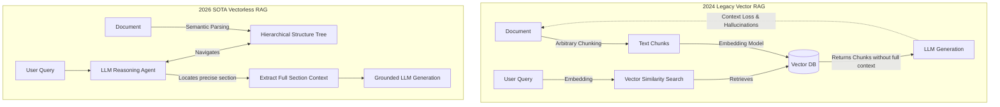

# 01. Vectorless RAG: Structural Navigation & LLM Reasoning Retrieval

## The Retrieval Paradigm Shift



## The Problem: The Flaws of Semantic "Vibe" Retrieval

In the early days of RAG (2023-2024), the industry standard was simple: take a document, chop it into arbitrary 512-token chunks, embed them using a model like `text-embedding-3-small`, and store them in a vector database. When a user asked a question, the system retrieved the top-K chunks with the highest cosine similarity.

This created the **"Vibe Retrieval" Bottleneck**. 
Vector embeddings measure *semantic proximity*, not factual relevance. If you chunk a 50-page commercial lease agreement, the section on "Termination" and the section on "Renewal" might look mathematically similar in vector space. Worse, because chunking is arbitrary, a crucial sentence might be split in half, or detached from its parent heading. The LLM was forced to answer complex questions using a handful of disconnected, out-of-context paragraphs, leading directly to hallucinations and fragile systems.

## The Solution: Vectorless RAG

By 2026, the industry recognized that for complex, structured documents (legal, medical, technical), we don't need semantic similarity; we need **structural reasoning**. 

**Vectorless RAG** abandons the vector database entirely. Instead of chunking, it parses the document into a hierarchical tree (Chapters -> Sections -> Subsections). When a query arrives, an LLM agent reads the "Table of Contents" (the top level of the tree), reasons about where the answer likely resides, and traverses down the tree until it locates the exact, intact section needed.

*   **Context Integrity**: The LLM receives the full, unbroken section.
*   **Explainability**: The retrieval path is a logical chain of thought (e.g., "I checked Section 3.2 because it relates to Liability"), not a black-box math score.
*   **Simplicity**: No embedding models, no vector databases, no dimension mismatch errors.

## Implementation: Building a Vectorless RAG Engine

Let's implement the core logic of a Vectorless RAG system. We will parse a document into a tree, and write an agent that navigates it.

### Python: The Reasoning Navigator

Python is excellent for defining the agentic loop that traverses the document structure.

```python
# Simulated 2026 AI Engineering SDK
from ai_agents import ReasoningClient
from document_parsers import HierarchicalParser

class VectorlessRAGEngine:
    def __init__(self, document_path: str):
        self.llm = ReasoningClient(model="gpt-6-astra")
        
        # 1. Parse the document into a structural tree, NOT chunks.
        # This preserves headings, paragraphs, and lists natively.
        self.doc_tree = HierarchicalParser.parse_pdf(document_path)
        
    def answer_query(self, query: str) -> str:
        print(f"[Vectorless RAG] Initiating structural search for: '{query}'")
        
        # Start at the root of the document (Table of Contents)
        current_node = self.doc_tree.root
        
        # 2. Agentic Traversal Loop
        while True:
            # We provide the LLM with the current node's children (e.g., Chapter titles)
            available_paths = current_node.get_children_summaries()
            
            # 3. The LLM acts as the router. It uses reasoning to pick the best path.
            decision = self.llm.structured_predict(
                prompt=f"Goal: {query}\nCurrent Location: {current_node.title}\nAvailable Sub-sections:\n{available_paths}\n\nSelect the ID of the most relevant sub-section, or output 'EXTRACT_HERE' if the current location contains the necessary depth.",
                schema={"action": "string", "target_node_id": "string", "reasoning": "string"}
            )
            
            print(f" -> [Agent Reasoning]: {decision['reasoning']}")
            
            if decision['action'] == 'EXTRACT_HERE' or not current_node.has_children():
                print(f"[Vectorless RAG] Target section located: {current_node.title}")
                break
            else:
                # Traverse deeper into the tree
                current_node = current_node.get_child(decision['target_node_id'])
                
        # 4. Generate the final answer using the 100% intact context
        intact_context = current_node.get_full_text()
        
        final_answer = self.llm.generate(
            prompt=f"Answer the query based ONLY on the following intact document section:\n\n{intact_context}\n\nQuery: {query}"
        )
        
        return final_answer

# Execution
engine = VectorlessRAGEngine("enterprise_SLA_contract.pdf")
response = engine.answer_query("What are the financial penalties for a Priority 1 outage?")
print(response)
```

### TypeScript: Tree Traversal in a Serverless Environment

In TypeScript, Vectorless RAG is perfect for serverless edge functions because it completely eliminates the need to maintain a connection to a heavy Vector Database like Pinecone or Milvus.

```typescript
import { ClaudeClient } from '@anthropic/native-sdk';
import { MarkdownTreeBuilder } from './utils/treeBuilder';

export class ServerlessVectorlessRAG {
    private llm: ClaudeClient;
    private documentTree: any;

    constructor(markdownContent: string) {
        // Initialize Claude Opus 5.5 for high-tier reasoning
        this.llm = new ClaudeClient({ model: 'claude-opus-5.5' });
        
        // Build the tree directly from Markdown headers (#, ##, ###)
        this.documentTree = MarkdownTreeBuilder.build(markdownContent);
    }

    async search(query: string): Promise<string> {
        let currentNode = this.documentTree;
        
        // Maximum depth to prevent infinite agentic loops
        for (let depth = 0; depth < 5; depth++) {
            const children = currentNode.getChildren();
            
            if (children.length === 0) {
                break; // Reached a leaf node (actual content)
            }

            const toc = children.map(c => `ID: ${c.id} | Title: ${c.title}`).join('\n');
            
            // Ask the model which branch to take
            const response = await this.llm.completeJSON({
                prompt: `You are searching a document for: "${query}". You are at "${currentNode.title}".\nSubsections:\n${toc}\nWhich ID should we explore? Or return "STOP" if we are deep enough.`,
                schema: { 
                    nextId: { type: "string" }, 
                    rationale: { type: "string" } 
                }
            });

            console.log(`[Navigation] Rationale: ${response.rationale}`);

            if (response.nextId === "STOP") break;
            
            currentNode = children.find(c => c.id === response.nextId) || currentNode;
        }

        // Generate final response using the isolated, structurally intact node
        return await this.llm.completeText(
            `Context:\n${currentNode.getContent()}\n\nQuestion: ${query}`
        );
    }
}
```

### Rust: High-Performance Concurrent Document Trees

When dealing with tens of thousands of documents, Rust allows us to load massive hierarchical structures into memory and perform lock-free concurrent traversals.

```rust
use gpt6_sdk::AstraClient;
use document_tree::{DocTree, NodeId};

pub struct RustVectorlessEngine {
    client: AstraClient,
    tree: DocTree,
}

impl RustVectorlessEngine {
    pub fn new(file_path: &str) -> Self {
        Self {
            client: AstraClient::new("gpt-6-astra"),
            tree: DocTree::from_xml(file_path).expect("Failed to parse XML structure"),
        }
    }

    pub async fn query(&self, user_question: &str) -> Result<String, Box<dyn std::error::Error>> {
        let mut current_node_id = self.tree.root_id();

        loop {
            let node = self.tree.get(current_node_id).unwrap();
            let children = self.tree.get_children(current_node_id);

            if children.is_empty() {
                break;
            }

            // Construct the navigation prompt
            let mut toc_prompt = format!("Query: {}\nCurrent Node: {}\nOptions:\n", user_question, node.title);
            for child in &children {
                toc_prompt.push_str(&format!("- {}: {}\n", child.id, child.title));
            }

            // Await the LLM's routing decision
            let decision = self.client.structured_route_decision(&toc_prompt).await?;
            
            println!("[Router] Decided to navigate to: {}", decision.selected_id);
            
            if decision.selected_id == "STOP" {
                break;
            }
            current_node_id = NodeId::from(decision.selected_id);
        }

        // Retrieve the full structurally sound text
        let exact_context = self.tree.get_full_text(current_node_id);
        
        let answer = self.client.generate_answer(&exact_context, user_question).await?;
        Ok(answer)
    }
}
```

### Julia: Scientific Paper Navigation

Julia excels at parsing highly structured academic papers (LaTeX to AST). We can use Vectorless RAG to navigate complex mathematical proofs without shredding the formulas.

```julia
using AI21SDK
using LaTeXParser

function scientific_vectorless_rag(latex_file::String, query::String)
    client = JambaClient(model="jamba-2-mini")
    
    # Parse LaTeX into a structural Abstract Syntax Tree (AST)
    # Sections, subsections, and math environments are preserved as nodes
    doc_ast = parse_latex_to_tree(latex_file)
    
    current_node = doc_ast.root
    
    println("[Research Agent] Locating answer for: $query")
    
    while !is_leaf(current_node)
        # Summarize the current level
        options = summarize_children(current_node)
        
        prompt = """
        Find the formula or explanation for: $query.
        You are in section: $(current_node.name)
        Sub-sections available:
        $options
        Return the ID to navigate to, or "EXTRACT" if the answer is here.
        """
        
        # The LLM reasons about mathematical document structure
        decision = structured_predict(client, prompt, schema=Dict("id"=>String, "reason"=>String))
        
        println(" -> Reason: ", decision["reason"])
        
        if decision["id"] == "EXTRACT"
            break
        end
        
        current_node = get_child(current_node, decision["id"])
    end
    
    # Extract the intact LaTeX environment to generate the final answer
    context = extract_latex_source(current_node)
    
    final_response = generate(client, "Context:\n$context\n\nQuery: $query")
    return final_response
end
```
