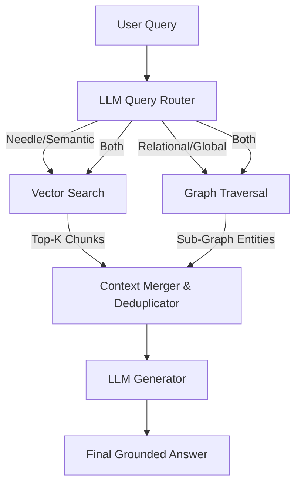

# 03. Hybrid RAG in Production: Merging Vector Search with Graph Traversals

## The Hybrid Pipeline



## The Problem: The Cost-Speed Tradeoff

By 2026, engineers realized that forcing an "either/or" choice between Vector RAG and GraphRAG was a mistake.

*   **Vector RAG** is incredibly fast, computationally cheap, and highly effective for simple "needle-in-a-haystack" queries (e.g., *"What is the exact IP address of the staging server?"*). However, it fails at relational synthesis.
*   **GraphRAG** is brilliant at multi-hop reasoning and "big picture" questions (e.g., *"How does the staging server outage affect downstream marketing campaigns?"*), but graph traversals are computationally heavier, and extracting the graph during indexing is expensive.

If an enterprise system relied solely on GraphRAG, they were wasting compute on simple queries. If they relied solely on Vector RAG, they failed complex queries.

## The Solution: Hybrid RAG Architectures

The modern production standard is **Hybrid RAG**. In this architecture, both a Vector Database and a Knowledge Graph exist side-by-side. 

When a query arrives, a fast, lightweight LLM (like Claude Fable 5.1 or GPT-6 Luna) acts as a **Query Router**. It classifies the intent of the user's question and decides whether to dispatch a semantic vector search, a graph traversal, or *both*. 

If both are executed, the resulting raw text chunks and graph relationships are piped into a **Context Merger**, which deduplicates the information, resolves conflicting data based on recency, and formats a unified context block for the heavyweight generator model (like Opus 5.5 or Astra).

## Implementation: The Hybrid Router and Merger

Let's look at how to implement a Hybrid RAG pipeline that intelligently routes and merges data.

### Python: The Hybrid Router

In Python, we build the core router that decides the execution path dynamically.

```python
import asyncio
# Simulated 2026 Hybrid RAG SDK
from hybrid_rag import VectorDB, GraphDB
from gpt6_sdk import AstraClient, LunaClient

class HybridRAGEngine:
    def __init__(self):
        self.vector_db = VectorDB(endpoint="localhost:6333")
        self.graph_db = GraphDB(endpoint="bolt://localhost:7687")
        
        # Fast, cheap model for routing
        self.router_llm = LunaClient(model="gpt-6-luna")
        # Heavyweight model for final synthesis
        self.generator_llm = AstraClient(model="gpt-6-astra")

    async def answer_query(self, query: str) -> str:
        print(f"[Hybrid RAG] Analyzing query: '{query}'")
        
        # 1. Routing Decision
        # Ask the fast model to classify the query type
        routing_decision = await self.router_llm.structured_predict(
            prompt=f"Classify this query: '{query}'. Does it require finding a specific fact (VECTOR), understanding relationships across multiple entities (GRAPH), or both (HYBRID)?",
            schema={"strategy": "string"} # Output must be strictly "VECTOR", "GRAPH", or "HYBRID"
        )
        
        strategy = routing_decision['strategy']
        print(f"[Router] Selected Strategy: {strategy}")
        
        # 2. Concurrent Execution
        tasks = []
        if strategy in ["VECTOR", "HYBRID"]:
            tasks.append(self.vector_db.search_async(query, top_k=5))
            
        if strategy in ["GRAPH", "HYBRID"]:
            # LLM extracts the starting nodes for the graph traversal
            entities = await self.router_llm.extract_entities(query)
            tasks.append(self.graph_db.traverse_async(start_nodes=entities, hops=2))
            
        # Execute the required searches in parallel
        results = await asyncio.gather(*tasks)
        
        # 3. Context Merging
        merged_context = ""
        if strategy == "HYBRID":
            # results[0] is Vector chunks, results[1] is Graph relations
            merged_context = f"--- Semantic Facts ---\n{results[0]}\n\n--- Entity Relationships ---\n{results[1]}"
        else:
            merged_context = results[0]
            
        # 4. Final Generation
        final_answer = await self.generator_llm.generate(
            prompt=f"Answer the query based ONLY on the following context:\n\n{merged_context}\n\nQuery: {query}"
        )
        
        return final_answer

# Execution
async def main():
    engine = HybridRAGEngine()
    
    # This will trigger the "VECTOR" strategy
    await engine.answer_query("What is the max token limit for GPT-4o?")
    
    # This will trigger the "HYBRID" or "GRAPH" strategy
    await engine.answer_query("How did the release of GPT-6 affect the pricing strategies of Anthropic's Opus models?")

if __name__ == "__main__":
    asyncio.run(main())
```

### TypeScript: Edge-Based Routing

In TypeScript, we often run the routing logic at the Edge (e.g., Vercel Edge Functions or Cloudflare Workers) to minimize latency before fanning out requests to the databases.

```typescript
import { VectorStore } from '@vector/sdk';
import { Neo4jClient } from '@neo4j/sdk';
import { FableClient, OpusClient } from '@anthropic/native-sdk';

export async function hybridEdgeHandler(req: Request) {
    const { query } = await req.json();
    
    const vectorDb = new VectorStore();
    const graphDb = new Neo4jClient();
    
    // Fable 5.1 is exceptionally fast, perfect for Edge routing
    const router = new FableClient({ model: 'claude-fable-5.1' });
    const generator = new OpusClient({ model: 'claude-opus-5.5' });
    
    // 1. Concurrent Route & Embed
    // We can start embedding the query for the vector DB at the same time
    // we ask the LLM to route it, saving hundreds of milliseconds.
    const [routingDecision, queryEmbedding] = await Promise.all([
        router.completeJSON({
            prompt: `Route this query: "${query}". Return "VECTOR", "GRAPH", or "HYBRID".`,
            schema: { route: { type: "string" } }
        }),
        vectorDb.embed(query)
    ]);
    
    const route = routingDecision.route;
    const fetchPromises: Promise<any>[] = [];
    
    // 2. Dispatch queries based on route
    if (route === 'VECTOR' || route === 'HYBRID') {
        fetchPromises.push(vectorDb.query(queryEmbedding, { topK: 3 }));
    }
    
    if (route === 'GRAPH' || route === 'HYBRID') {
        const rootEntities = await router.extractEntities(query);
        fetchPromises.push(graphDb.traverse(rootEntities));
    }
    
    const rawResults = await Promise.all(fetchPromises);
    
    // 3. Construct the prompt string based on what was returned
    const context = rawResults.map(r => typeof r === 'string' ? r : r.asMarkdown()).join('\n\n');
    
    // 4. Generate the final response
    const answer = await generator.completeText(`
        Context:\n${context}\n\nQuestion: ${query}
    `);
    
    return new Response(JSON.stringify({ answer, route_used: route }));
}
```

### Rust & Julia: Context Deduplication

In languages like **Rust** and **Julia**, which often sit at the data engineering layer, the "Context Merger" step is much more advanced. 

When both Vector and Graph databases return data, there is often massive overlap (the same paragraph is returned by vector search, and its entities are returned by graph search). A pure LLM generator might get confused by the repetition or contradictory timestamps.

In Rust, an AI Engineer might write a high-performance **Deduplication Engine**:

```rust
// Rust pseudo-code for Context Merging
fn merge_and_deduplicate(vector_chunks: Vec<Chunk>, graph_nodes: Vec<Node>) -> String {
    let mut unified_context = String::new();
    let mut seen_source_ids = HashSet::new();
    
    // 1. Prioritize graph relationships for structural integrity
    for node in graph_nodes {
        unified_context.push_str(&format!("Entity {} relates to {} via {}\n", node.source, node.target, node.edge));
        seen_source_ids.insert(node.source_document_id);
    }
    
    // 2. Only append vector chunks if they provide novel information not covered by the graph
    for chunk in vector_chunks {
        if !seen_source_ids.contains(&chunk.document_id) {
            // Novel semantic information found
            unified_context.push_str(&format!("Additional Context: {}\n", chunk.text));
        } else if chunk.timestamp > get_graph_node_timestamp(&chunk.document_id) {
            // Vector chunk is newer, use it to override stale graph data
            unified_context.push_str(&format!("UPDATE: {}\n", chunk.text));
        }
    }
    
    unified_context
}
```

This ensures that the heavyweight LLM generator (Astra or Opus) is fed a dense, non-redundant, and temporally accurate context block, guaranteeing the highest quality outputs for Hybrid RAG systems.
