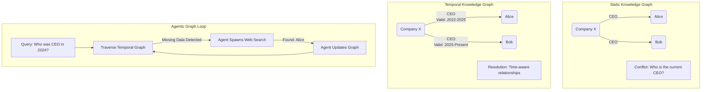

# 04. Temporal & Agentic Knowledge Graphs (Graphiti, HGMem)

## The Evolution of Graph Memory



## The Problem: State Corruption and Static Snapshots

Basic Vector RAG and early GraphRAG systems share a critical flaw: they represent a **static snapshot of time**. 

When building Long-Horizon Agents (agents that run for days or weeks), the environment changes. If your agent is tracking a company, and the CEO changes from Alice to Bob, what happens to the knowledge base?
*   **Vector RAG** simply ingests a new chunk saying "Bob is CEO." The database now contains two chunks: one saying Alice is CEO, one saying Bob is CEO. The LLM is forced to guess which is true.
*   **Basic GraphRAG** might overwrite the `CEO` edge, pointing it to Bob. But what if a user asks, *"Who was the CEO last year?"* That history has been permanently erased.

Furthermore, these graphs were passive. If the graph lacked the answer, the system simply failed and returned "I don't know."

## The Solution: Temporal and Agentic Graphs

By 2026, frameworks like **Graphiti** (built on Neo4j) and **HGMem** (Hypergraph Memory) standardized two new paradigms:

1.  **Temporal Graphs**: Every edge (relationship) in the graph has a `ValidFrom` and `ValidTo` timestamp. The graph becomes a 4D structure. You don't just query the graph; you query the graph *at a specific point in time*.
2.  **Agentic Graphs**: The graph is no longer a passive database. It is an active participant in the agent loop. If the LLM traverses the graph and realizes an edge is missing, it autonomously spawns a tool call (e.g., a web search or database SQL query), extracts the missing entity, writes it into the graph in real-time, and resumes traversal.

## Implementation: Time-Aware and Active Retrieval

Let's look at how AI Engineers implement Temporal and Agentic graphs.

### Python: Agentic Graph Completion

Using a simulated 2026 `Graphiti` framework, we build an agentic graph that actively repairs its own missing data during a query.

```python
# Simulated 2026 Agentic Graph SDK
from graphiti_sdk import TemporalGraph, GraphAgent
from tools import WebSearchTool

def run_agentic_graph_query():
    # 1. Initialize the Temporal Graph
    graph = TemporalGraph(uri="bolt://localhost:7687")
    
    # 2. Initialize the Graph Agent with external tools
    # The agent is granted permission to mutate the graph during execution.
    agent = GraphAgent(
        model="gpt-6-astra",
        graph=graph,
        tools=[WebSearchTool()]
    )
    
    query = "What was the stock price of OpenAI when Sam Altman was briefly ousted?"
    print(f"[Agent] Processing query: {query}")
    
    # 3. Execute the Agentic Query
    # Behind the scenes:
    # - The agent queries the graph for "OpenAI" -> "CEO" -> "Sam Altman"
    # - It filters by the temporal edge "Ousted" to find the exact date (Nov 2023).
    # - It checks the graph for "OpenAI Stock Price" on that date.
    # - If the stock price entity is MISSING, the agent suspends the query, 
    #   uses the WebSearchTool, finds the data, WRITES it to the graph, and resumes.
    response = agent.execute_with_self_repair(query)
    
    print(f"\n[Response]: {response.text}")
    print(f"\n[Graph Mutations]: {response.graph_mutations_made} new edges created during query.")

if __name__ == "__main__":
    run_agentic_graph_query()
```

### TypeScript: Temporal Edge Traversal

In TypeScript, we frequently write the backend logic that filters these massive 4D graphs based on user timeframes.

```typescript
import { TemporalGraphClient } from '@graphiti/sdk';

async function queryTemporalGraph() {
    const db = new TemporalGraphClient({ endpoint: 'http://localhost:7687' });
    
    // We want to know the leadership structure of 'TechCorp' specifically in 2024.
    const targetDate = new Date('2024-06-01T00:00:00Z').getTime();
    
    console.log(`[Query] Fetching TechCorp leadership for timestamp: ${targetDate}`);
    
    // 1. Execute a Temporal Traversal
    // The database natively filters out any edges where `targetDate` does not fall
    // between `ValidFrom` and `ValidTo`.
    const graphState = await db.traverse({
        startNode: { label: 'Company', name: 'TechCorp' },
        edgeType: 'HAS_EXECUTIVE',
        temporalFilter: {
            activeAt: targetDate
        }
    });
    
    // 2. Output the exact historical state
    console.log('[Result] Active Executives in June 2024:');
    graphState.nodes.forEach(node => {
        console.log(`- ${node.name} (${node.properties.role})`);
    });
    
    // 3. Contrast with Current State
    const currentState = await db.traverse({
        startNode: { label: 'Company', name: 'TechCorp' },
        edgeType: 'HAS_EXECUTIVE',
        temporalFilter: {
            activeAt: Date.now() // Fetch the present day
        }
    });
    
    console.log('\n[Result] Active Executives Today:');
    currentState.nodes.forEach(node => {
        console.log(`- ${node.name} (${node.properties.role})`);
    });
}

queryTemporalGraph().catch(console.error);
```

### Rust: High-Performance Ephemeral Graph Merges

For production systems, writing to the global graph for every missing piece of data can corrupt a shared enterprise database. In Rust, we use **Ephemeral Graph Merges**. The agent writes its discoveries to a local, in-memory graph, which is merged with the global graph for the duration of the query, and discarded (or sent for human review) afterward.

```rust
use hgmem_rs::{GlobalGraph, EphemeralGraph, AgenticTraverser};
use gpt6_sdk::LunaClient;

#[tokio::main]
async fn main() -> Result<(), Box<dyn std::error::Error>> {
    // 1. Connect to the read-only enterprise global graph
    let global_db = GlobalGraph::connect("bolt://enterprise-db:7687").await?;
    
    // 2. Create an in-memory ephemeral graph for this specific agent run
    let mut session_graph = EphemeralGraph::new_in_memory();
    
    let llm = LunaClient::new("gpt-6-luna");
    let mut traverser = AgenticTraverser::new(llm);
    
    let query = "Identify the vulnerability in the latest commit and trace its author.";
    
    // 3. Execute the traversal
    // The traverser reads from `global_db`. When it needs to run a bash script to check 
    // the git history, it writes the extracted author entity to `session_graph`.
    let answer = traverser.execute_with_ephemeral_state(
        query,
        &global_db,
        &mut session_graph
    ).await?;
    
    println!("[Agent] {}", answer);
    
    // 4. The session graph can now be audited by a human before committing to the global DB
    println!("[Audit] Agent discovered {} new temporal edges.", session_graph.edge_count());
    
    // If approved, commit to global:
    // global_db.commit(session_graph).await?;
    
    Ok(())
}
```

By adding **Time** and **Agency** to Knowledge Graphs, 2026 RAG architectures transformed from static encyclopedias into living, breathing memory systems that evolve seamlessly alongside the AI Agents that use them.
