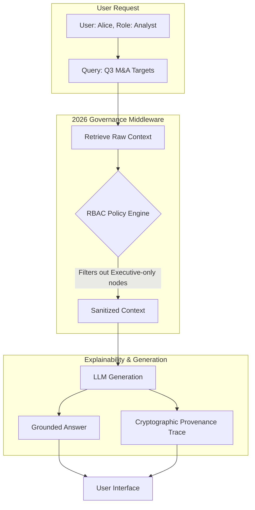

# 05. Explainability and Governance in 2026 Retrieval Systems

## The Governance Pipeline



## The Problem: Black-Box RAG and Privilege Escalation

As RAG transitioned from prototype to enterprise deployment, it collided with rigorous security and compliance audits (like SOC 2, HIPAA, and the EU AI Act). Two massive vulnerabilities were exposed in legacy 2024 systems:

1.  **The Black Box (Lack of Explainability)**: If an AI outputted a financial prediction, auditing the "why" was nearly impossible. The system retrieved 10 arbitrary chunks based on floating-point cosine similarity scores, leaving compliance officers with no logical chain of reasoning.
2.  **Privilege Escalation (Data Leakage)**: Vector databases typically embed text indiscriminately. An intern querying "Company restructuring" might retrieve vector chunks generated from a confidential CEO memo they shouldn't have access to. 

## The Solution: Explicit Provenance and Graph RBAC

The 2026 standards for Next-Generation RAG architectures completely resolved these issues through two mechanisms:

1.  **Graph and Structural Explainability**: Because Vectorless RAG and GraphRAG use explicit logical steps (navigating a document tree, or traversing named graph edges), the system natively generates a **Provenance Trace**. The AI can say precisely: *"I answered X because I followed the 'Impacts' edge from Node A to Node B."*
2.  **Node-Level RBAC (Role-Based Access Control)**: Before context is passed to the LLM generator, a middleware layer evaluates the user's cryptographic token against the metadata of every single graph node or document section retrieved, instantly pruning data they lack clearance for.

## Implementation: Building Compliant Retrieval

Let's look at how to implement strict governance and explainability tracking.

### Python: The Explainability Tracer

In Python, we implement a wrapper that intercepts the LLM's reasoning loop and generates a cryptographic audit trail.

```python
import hashlib
import time
# Simulated 2026 Enterprise RAG SDK
from enterprise_rag import RAGClient
from auth_service import get_user_session

class AuditableRAGEngine:
    def __init__(self):
        self.engine = RAGClient(model="gpt-6-astra", mode="graph")
        
    def query_with_audit_trail(self, query: str, user_token: str):
        # 1. Authenticate user
        session = get_user_session(user_token)
        print(f"[Audit] Request initiated by user: {session.username} (Role: {session.role})")
        
        # 2. Execute query while capturing the internal trace
        # The 2026 SDK natively exposes the internal routing and traversal steps
        response, trace = self.engine.query_with_trace(
            query=query,
            user_role=session.role # Injects RBAC filtering at the database layer
        )
        
        # 3. Generate a cryptographic hash of the trace for compliance archiving
        trace_json = trace.to_json()
        trace_hash = hashlib.sha256(f"{trace_json}-{time.time()}".encode()).hexdigest()
        
        # 4. Save to secure audit log (WORM storage in production)
        self.archive_audit_log(session.username, query, trace_json, trace_hash)
        
        # 5. Return both the answer and the human-readable explanation
        return {
            "answer": response.text,
            "explanation": trace.get_human_readable_summary(),
            "audit_id": trace_hash
        }
        
    def archive_audit_log(self, user, query, trace, hash_val):
        # In production, this writes to an immutable ledger or secure S3 bucket
        print(f"[Audit] Trace {hash_val[:8]} archived for compliance.")

# Example Execution
engine = AuditableRAGEngine()
result = engine.query_with_audit_trail("Summarize the Q3 Risk Report", "token_alice_123")

print("\n--- Answer ---")
print(result["answer"])
print("\n--- Explainability Trace ---")
print(result["explanation"]) 
# e.g., "Filtered 14 nodes. Traversed [Q3 Report] -> [Risk Section]. Rejected [Executive Summary] due to RBAC."
```

### TypeScript: Middleware RBAC Filtering

In TypeScript, governance is often handled as a middleware function sitting between the database retrieval step and the final LLM generation step.

```typescript
import { GraphDatabase, Node } from '@enterprise/graph-sdk';
import { OpusClient } from '@anthropic/native-sdk';

interface UserContext {
    id: string;
    clearanceLevel: number;
    department: string;
}

export class GovernanceMiddleware {
    /**
     * Takes an array of raw nodes retrieved from the database and prunes them
     * based on the user's exact permissions before the LLM ever sees them.
     */
    static enforceRBAC(rawNodes: Node[], user: UserContext): Node[] {
        console.log(`[Governance] Evaluating ${rawNodes.length} nodes for user ${user.id}...`);
        
        return rawNodes.filter(node => {
            const requiredClearance = node.metadata.securityClearance || 1;
            const allowedDepartments = node.metadata.departments || ['ALL'];
            
            // 1. Check Clearance Level (e.g., Level 5 Top Secret)
            if (user.clearanceLevel < requiredClearance) {
                console.warn(`[Governance] Blocked node ${node.id}: Insufficient clearance.`);
                return false;
            }
            
            // 2. Check Department Isolation
            if (allowedDepartments[0] !== 'ALL' && !allowedDepartments.includes(user.department)) {
                console.warn(`[Governance] Blocked node ${node.id}: Department mismatch.`);
                return false;
            }
            
            return true; // Node is safe to pass to LLM
        });
    }
}

async function secureQueryHandler(query: string, user: UserContext) {
    const db = new GraphDatabase();
    const llm = new OpusClient({ model: 'claude-opus-5.5' });
    
    // 1. Retrieve raw data (potentially over-fetching sensitive data)
    const rawContextNodes = await db.traverseAndFetch(query);
    
    // 2. Enforce strict Governance BEFORE LLM generation
    const sanitizedNodes = GovernanceMiddleware.enforceRBAC(rawContextNodes, user);
    
    if (sanitizedNodes.length === 0) {
        return "I could not find any information you are authorized to view regarding this query.";
    }
    
    // 3. Format the sanitized context
    const contextString = sanitizedNodes.map(n => n.content).join('\n');
    
    // 4. Generate the secure answer
    const answer = await llm.completeText(`
        Context:\n${contextString}\n\nQuestion: ${query}
    `);
    
    return answer;
}
```

By mandating **Explainability** and **Governance**, 2026 RAG systems transformed AI from experimental proof-of-concepts into trustworthy, legally compliant enterprise systems capable of handling the world's most sensitive data.
