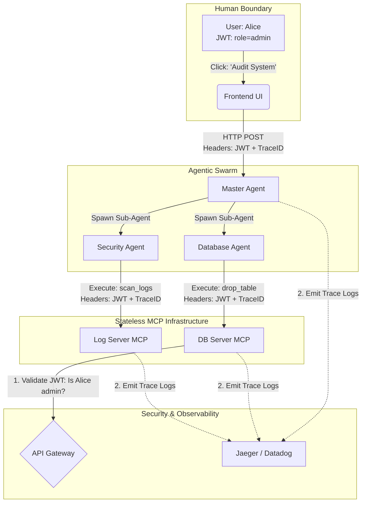

# 05. Production-Grade Agentic Security and OpenTelemetry Propagation

## The Distributed Trace Architecture



## The Problem: The "Confused Deputy" and Lost Traces

As AI Engineering matured, the introduction of multi-agent stateless architectures (Lessons 1-4) created two massive operational nightmares for enterprise DevOps and Security teams:

1.  **The Confused Deputy Problem (Security)**: Imagine a human user, "Bob" (a junior analyst with read-only access), asks a Master Agent to "optimize the database." The Master Agent has system-level credentials. It spawns a sub-agent, which connects to the Database MCP Server and executes a `DROP TABLE` command. The database executes it because the *Agent* asked for it, completely forgetting that *Bob* initiated the action. The Agent acted as a confused deputy, accidentally bypassing Bob's permissions.
2.  **The Black Hole (Observability)**: If an agent spawns three sub-agents, and one of them fails due to a network timeout on an async webhook, debugging it is impossible. The logs are scattered across dozens of stateless Kubernetes pods with no shared Request ID.

## The Solution: W3C Trace Context and Identity Delegation

The July 2026 Stateless MCP specification explicitly adopted standard cloud-native paradigms to solve these issues:

1.  **Identity Delegation (JWT Propagation)**: Agents do not have their own permissions. Instead, the Agent intercepts the human user's `Bearer Token` (JWT/OAuth) at the frontend. Every time the Agent (or any sub-agent) makes a stateless MCP request, it passes that exact JWT in the Authorization header. The final MCP tool evaluates the human's permissions, preventing the Confused Deputy problem.
2.  **OpenTelemetry (OTel) Propagation**: Following the W3C Trace Context standard, the frontend generates a unique `traceparent` ID. This ID is passed in the headers of every single LLM call, sub-agent spawn, and MCP execution. Datadog, Jaeger, or Grafana can then stitch together the entire recursive execution tree into a single, unified visual trace.

## Implementation: Building Secure, Observable Tools

Let's implement a secure MCP tool that validates propagated identity and emits OpenTelemetry traces.

### TypeScript: Passing Context in the Client

In TypeScript, when the Master Agent calls an MCP tool, it must inject the human's security token and the OTel trace headers into the request.

```typescript
// Simulated 2026 Stateless MCP SDK with OTel integration
import { StatelessClient } from '@mcp/stateless-client';
import { trace, context, propagation } from '@opentelemetry/api';

async function executeSubAgentTask(humanJwt: string, task: string) {
    const mcpClient = new StatelessClient('https://api.enterprise.internal/mcp');
    
    // 1. Hook into the global OpenTelemetry tracer
    const tracer = trace.getTracer('master-agent-tracer');
    
    // 2. Start a new span for this specific tool execution
    return await tracer.startActiveSpan('execute_database_tool', async (span) => {
        try {
            // 3. Inject the OTel trace context into HTTP headers
            // This turns local trace data into a W3C 'traceparent' header string
            const headers = {};
            propagation.inject(context.active(), headers);
            
            // 4. Inject the Human Identity (Delegation)
            headers['Authorization'] = `Bearer ${humanJwt}`;
            
            console.log(`[Agent] Calling MCP Tool with TraceID: ${span.spanContext().traceId}`);
            
            // 5. Execute the stateless tool, passing the security and trace headers
            const result = await mcpClient.execute(
                "drop_table", 
                { table_name: "temp_logs" },
                { headers: headers }
            );
            
            span.setStatus({ code: 1 }); // 1 = OK
            return result;
            
        } catch (error) {
            span.setStatus({ code: 2, message: error.message }); // 2 = ERROR
            span.recordException(error);
            throw error;
        } finally {
            span.end();
        }
    });
}
```

### Python: Validating Context in the Server

On the Python server running the MCP tool, we intercept the incoming headers. We validate the JWT to ensure the human (Bob) is actually allowed to drop tables, and we extract the `traceparent` so our server logs are attached to the exact same trace ID generated by the TypeScript client.

```python
from fastapi import FastAPI, Request, HTTPException
import jwt
# OpenTelemetry SDKs
from opentelemetry import trace, propagate
from opentelemetry.instrumentation.fastapi import FastAPIInstrumentor

app = FastAPI()
FastAPIInstrumentor.instrument_app(app) # Automatically handles W3C Trace headers!

tracer = trace.get_tracer(__name__)

# Secret key used to verify the company's JWTs
JWT_SECRET = "super_secure_enterprise_secret"

@app.post("/tools/call")
async def handle_mcp_tool(req: Request):
    # 1. OpenTelemetry has already automatically extracted the `traceparent` header 
    # thanks to the FastAPIInstrumentor. Any span we create here will be natively 
    # linked to the Agent's parent trace in Datadog/Jaeger.
    
    with tracer.start_as_current_span("mcp_tool_handler") as span:
        # 2. Identity Extraction
        auth_header = req.headers.get("Authorization")
        if not auth_header or not auth_header.startswith("Bearer "):
            span.set_attribute("security.auth_failure", "Missing Token")
            raise HTTPException(status_code=401, detail="Unauthorized: No human identity provided.")
            
        token = auth_header.split(" ")[1]
        
        try:
            # 3. Cryptographic Identity Validation
            # We verify the token hasn't been tampered with and extract the human's roles.
            payload = jwt.decode(token, JWT_SECRET, algorithms=["HS256"])
            human_user = payload.get("sub")
            human_role = payload.get("role")
            
            span.set_attribute("user.id", human_user)
            span.set_attribute("user.role", human_role)
            
            data = await req.json()
            tool_name = data["params"]["name"]
            
            # 4. RBAC (Role-Based Access Control) Enforcement
            # The Confused Deputy problem is solved. The Agent's request fails 
            # because the HUMAN (Bob) lacks the 'admin' role.
            if tool_name == "drop_table" and human_role != "admin":
                span.set_attribute("security.blocked", True)
                raise HTTPException(
                    status_code=403, 
                    detail=f"Forbidden: User {human_user} lacks permissions for {tool_name}."
                )
                
            # 5. Execute Tool
            print(f"[Server] User {human_user} authorized. Executing {tool_name}.")
            # ... execution logic ...
            
            return {"status": "success", "content": "Table dropped successfully."}
            
        except jwt.ExpiredSignatureError:
            raise HTTPException(status_code=401, detail="Token Expired")
        except jwt.InvalidTokenError:
            raise HTTPException(status_code=401, detail="Invalid Token")
```

By enforcing **Identity Delegation** and **OpenTelemetry Propagation**, the 2026 AI Engineering ecosystem matured. Agents were no longer rogue scripts running on laptops; they were fully integrated, auditable, and strictly governed citizens of the enterprise cloud network.
