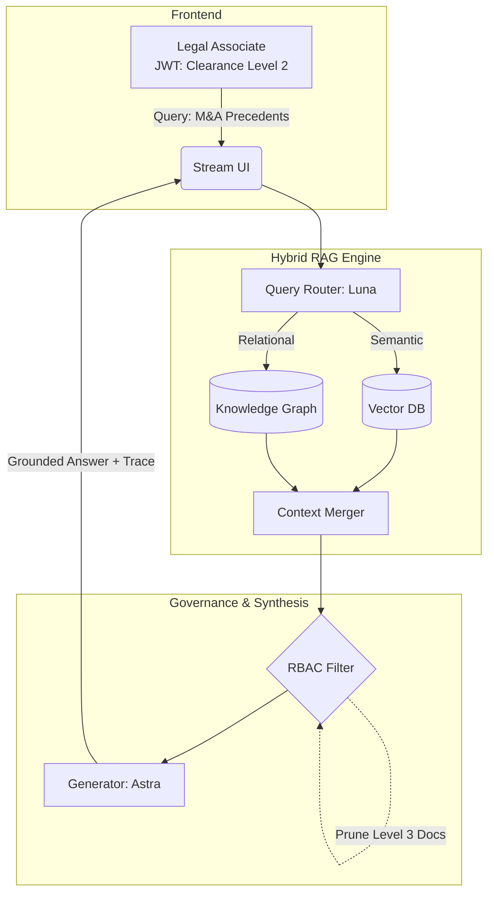

# 01. Capstone 1: Enterprise Hybrid RAG Legal Assistant

## The Capstone Architecture



## Project Overview

In this capstone, we will synthesize the concepts from **Phase 20 (Next-Generation RAG Architectures)**. You will build a production-grade Legal Assistant that utilizes a Hybrid RAG pipeline. 

Legal documents are both semantically dense (requiring vector search for precise clause matching) and highly relational (requiring graph traversal to understand how different contracts relate to parent corporate entities). Furthermore, strict governance (RBAC) is non-negotiable.

### Core Requirements

1.  **Hybrid Routing**: Use a fast, lightweight LLM to route incoming legal queries to a Vector Database, a Knowledge Graph, or both.
2.  **Context Merging**: Deduplicate the retrieved chunks and graph edges.
3.  **Strict Governance**: Implement a middleware that intercepts the merged context and prunes any nodes that exceed the user's cryptographic security clearance.
4.  **Explainability**: Return not just the answer, but the exact graph edges traversed to reach that answer.

## Implementation: The Complete Legal Pipeline

Below is the complete architectural implementation in TypeScript, designed to run in a secure serverless environment.

```typescript
import { FableClient, AstraClient } from '@ai-engineering/sdk';
import { VectorStore, GraphDatabase, Node } from '@enterprise/dbs';
import { verifyJWT, extractUserContext, UserContext } from './auth';
import crypto from 'crypto';

// --- 1. The Middleware ---
class SecurityMiddleware {
    static filterContext(rawNodes: Node[], user: UserContext): Node[] {
        console.log(`[Security] Filtering ${rawNodes.length} nodes for clearance: ${user.clearance}`);
        return rawNodes.filter(node => node.metadata.requiredClearance <= user.clearance);
    }
}

class ContextMerger {
    static merge(vectorResults: Node[], graphResults: Node[]): string {
        const uniqueIds = new Set<string>();
        let mergedText = "--- LEGAL PRECEDENTS (SEMANTIC) ---\n";
        
        for (const node of vectorResults) {
            if (!uniqueIds.has(node.id)) {
                mergedText += `${node.content}\n`;
                uniqueIds.add(node.id);
            }
        }
        
        mergedText += "\n--- ENTITY RELATIONSHIPS (GRAPH) ---\n";
        for (const node of graphResults) {
            if (!uniqueIds.has(node.id)) {
                mergedText += `${node.content}\n`;
                uniqueIds.add(node.id);
            }
        }
        return mergedText;
    }
}

// --- 2. The Core Engine ---
export class LegalAssistantRAG {
    private router = new FableClient({ model: 'gpt-6-luna' });
    private generator = new AstraClient({ model: 'gpt-6-astra' });
    private vectors = new VectorStore();
    private graph = new GraphDatabase();

    async answerQuery(query: string, authHeader: string) {
        // 1. Authenticate Human User
        const token = authHeader.replace('Bearer ', '');
        const user = extractUserContext(verifyJWT(token));
        
        // 2. Hybrid Routing
        const route = await this.router.structuredPredict(
            `Classify legal query: "${query}". Return VECTOR, GRAPH, or HYBRID.`,
            { strategy: "string" }
        );
        
        const fetchPromises: Promise<Node[]>[] = [];
        
        if (route.strategy === 'VECTOR' || route.strategy === 'HYBRID') {
            fetchPromises.push(this.vectors.search(query, { topK: 5 }));
        }
        
        if (route.strategy === 'GRAPH' || route.strategy === 'HYBRID') {
            const entities = await this.router.extractEntities(query);
            fetchPromises.push(this.graph.traverse(entities, { maxHops: 2 }));
        }
        
        // 3. Concurrent Data Fetching
        const rawResultsArray = await Promise.all(fetchPromises);
        const vectorNodes = route.strategy === 'VECTOR' || route.strategy === 'HYBRID' ? rawResultsArray[0] : [];
        const graphNodes = route.strategy === 'GRAPH' ? rawResultsArray[0] : (route.strategy === 'HYBRID' ? rawResultsArray[1] : []);
        
        // 4. Governance Enforcement
        const safeVectorNodes = SecurityMiddleware.filterContext(vectorNodes, user);
        const safeGraphNodes = SecurityMiddleware.filterContext(graphNodes, user);
        
        if (safeVectorNodes.length === 0 && safeGraphNodes.length === 0) {
            return { answer: "Insufficient clearance to access these legal precedents.", traceId: null };
        }
        
        // 5. Context Merging
        const context = ContextMerger.merge(safeVectorNodes, safeGraphNodes);
        
        // 6. Final Generation
        const answer = await this.generator.generate(`
            You are a senior legal counsel AI. Answer the query based strictly on the provided context.
            Context:
            ${context}
            
            Query: ${query}
        `);
        
        // 7. Audit Trace
        const traceId = crypto.randomUUID();
        console.log(`[Audit: ${traceId}] User ${user.id} accessed ${safeVectorNodes.length + safeGraphNodes.length} documents.`);
        
        return { answer, traceId };
    }
}
```

## Running the Project

To execute this capstone locally, you will need to start the mock authentication server and populate the databases.

1.  Start the Vector Database (Pinecone or local Milvus simulator).
2.  Start the Graph Database (Neo4j).
3.  Execute the script passing in a Level 1 Token (Standard) and a Level 5 Token (Partner) to witness the RBAC filter dynamically alter the LLM's response based on clearance levels.
