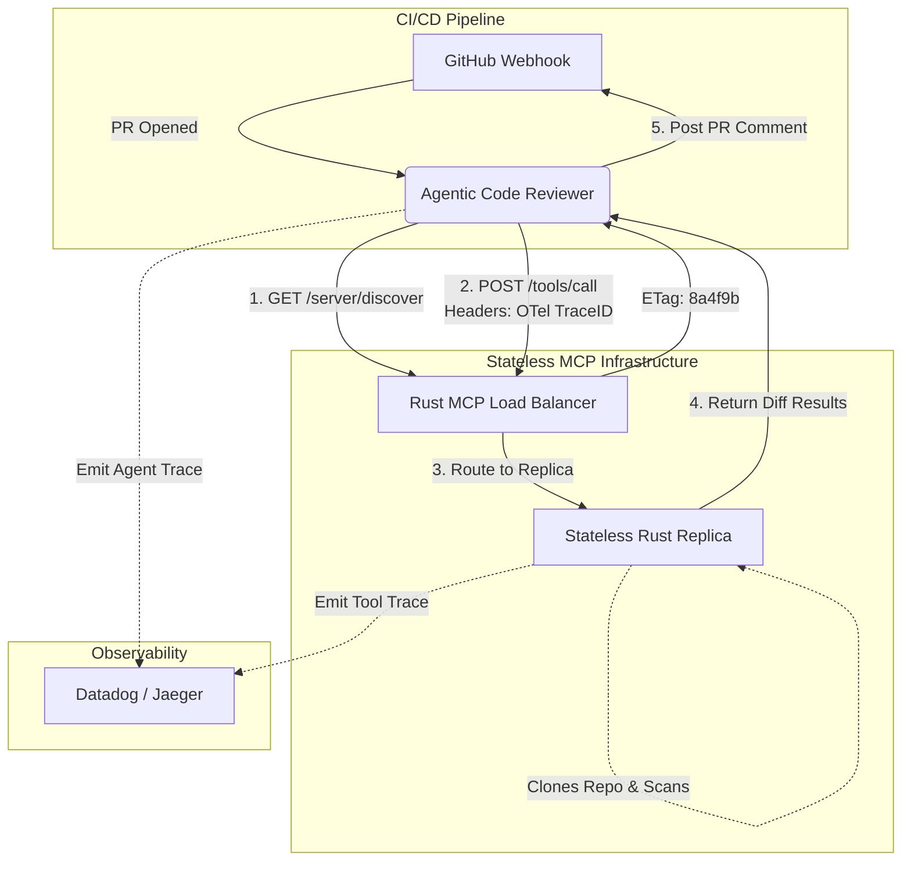

# 02. Capstone 2: Stateless Agentic Code Reviewer with OTel

## The Capstone Architecture



## Project Overview

In this capstone, we will synthesize the concepts from **Phase 21 (Advanced Agentic Patterns & Stateless MCP)**. You will build a Production-Grade Agentic Code Reviewer.

Legacy (2024) code reviewer agents often timed out on large repositories because they relied on synchronous WebSockets or blocking REST calls. Furthermore, when they crashed, DevOps teams had no way to trace the execution path. By leveraging the **July 2026 Stateless MCP Spec** and **OpenTelemetry (OTel)**, our reviewer will be infinitely horizontally scalable and perfectly observable.

### Core Requirements

1.  **Stateless Discovery**: The agent must hit the `/server/discover` endpoint and cache the tool schemas using ETags.
2.  **Self-Describing Requests**: The agent must send capabilities and ETags with every tool execution request.
3.  **W3C Trace Propagation**: The Python Agent must generate a W3C trace ID and propagate it to the Rust MCP Server, ensuring a single unified distributed trace in Jaeger/Datadog.

## Implementation: The Scalable Code Reviewer

Below is the implementation spanning both the Python Agent client and the Rust Stateless MCP Server.

### The Python Agent (Client)

This Python agent runs in a serverless function (like AWS Lambda). It wakes up via a GitHub webhook, caches the tool schemas, and executes the code review.

```python
import httpx
import os
# Simulated 2026 SDKs
from opentelemetry import trace, propagate
from opentelemetry.context import context
from mcp_stateless import StatelessDiscoveryClient
from gpt6_sdk import AstraClient

tracer = trace.get_tracer("agentic-pr-reviewer")

async def review_pull_request(repo_url: str, pr_number: int):
    # 1. Start the distributed trace for this entire execution
    with tracer.start_as_current_span("review_pull_request_flow") as parent_span:
        parent_span.set_attribute("repo", repo_url)
        parent_span.set_attribute("pr_number", pr_number)
        
        # 2. Initialize the Stateless MCP Client
        mcp_client = StatelessDiscoveryClient("https://mcp-git.enterprise.internal")
        llm = AstraClient(model="gpt-6-astra")
        
        # 3. Inject OTel Trace Context into headers for propagation
        headers = {}
        propagate.inject(context, headers)
        
        # 4. Execute the tool using Stateless Discovery and ETags
        # Under the hood, this handles cache misses (HTTP 412) autonomously
        print(f"[Agent] Fetching diff for PR #{pr_number}...")
        diff_result = await mcp_client.execute_tool(
            "fetch_pr_diff",
            {"repo": repo_url, "pr": pr_number},
            headers=headers # Passing the trace ID to the Rust server!
        )
        
        # 5. Review the code using the Frontier LLM
        print("[Agent] Analyzing code diff...")
        with tracer.start_as_current_span("llm_reasoning_step"):
            review_comment = await llm.generate(
                prompt=f"Review the following PR diff for security vulnerabilities and logical errors. Be concise.\n\n{diff_result['content']}"
            )
            
        print("[Agent] Review Complete:")
        print(review_comment)
        return review_comment

# Example Execution
import asyncio
asyncio.run(review_pull_request("github.com/enterprise/core-auth", 402))
```

### The Rust Stateless Server (Tool Execution)

This Rust server handles the heavy lifting (cloning the repo, extracting the diff). It is deployed in Kubernetes behind an auto-scaler. Crucially, it extracts the OTel headers from the Python agent.

```rust
use actix_web::{web, App, HttpServer, HttpRequest, HttpResponse, Responder};
use serde::{Deserialize, Serialize};
use opentelemetry::global;
use opentelemetry_http::HeaderExtractor;

#[derive(Deserialize)]
struct MCPRequest {
    method: String,
    params: PRParams,
}

#[derive(Deserialize)]
struct PRParams {
    name: String,
    arguments: serde_json::Value,
}

#[derive(Serialize)]
struct MCPResponse {
    status: String,
    content: String,
}

// The stateless tool handler
async fn handle_tool_execution(req: HttpRequest, body: web::Json<MCPRequest>) -> impl Responder {
    let tool_name = &body.params.name;
    
    // 1. Extract the W3C Trace Context propagated from the Python Agent!
    let parent_cx = global::get_text_map_propagator(|prop| {
        prop.extract(&HeaderExtractor(req.headers()))
    });
    
    // 2. Start a local span that is a CHILD of the Python agent's span
    let tracer = global::tracer("rust-git-mcp");
    let span = tracer.start_with_context(format!("execute_{}", tool_name), &parent_cx);
    
    println!("[Rust Server] Processing PR diff request. Linked to TraceID.");
    
    // 3. Stateless execution logic (Simulated Git operations)
    let repo = body.params.arguments.get("repo").unwrap().as_str().unwrap();
    let pr_number = body.params.arguments.get("pr").unwrap().as_i64().unwrap();
    
    // (In reality, we would run `git clone` and `git diff` here)
    let fake_diff = format!("--- a/auth.js\n+++ b/auth.js\n- const verify = false;\n+ const verify = true; // Fixed by PR {}", pr_number);
    
    // 4. Return result immediately. Server drops all memory of the client.
    HttpResponse::Ok().json(MCPResponse {
        status: "success".to_string(),
        content: fake_diff,
    })
}

#[actix_web::main]
async fn main() -> std::io::Result<()> {
    // Initialize OpenTelemetry
    // global::set_tracer_provider(...);
    
    println!("Starting Stateless Git MCP Server on port 8080");
    
    HttpServer::new(|| {
        App::new()
            .route("/tools/call", web::post().to(handle_tool_execution))
    })
    .bind(("0.0.0.0", 8080))?
    .run()
    .await
}
```

## Running the Project

To execute this capstone:
1.  Run the **Rust Server** on `localhost:8080`.
2.  Boot up a local instance of **Jaeger** (using Docker) to collect the distributed traces.
3.  Execute the **Python Agent**. 
4.  Open the Jaeger dashboard. You will see a single, beautiful unified trace starting at the `review_pull_request_flow` in Python, jumping across the network into the `execute_fetch_pr_diff` span in Rust, and returning to the `llm_reasoning_step` in Python. 

This represents the absolute pinnacle of 2026 enterprise observability.
