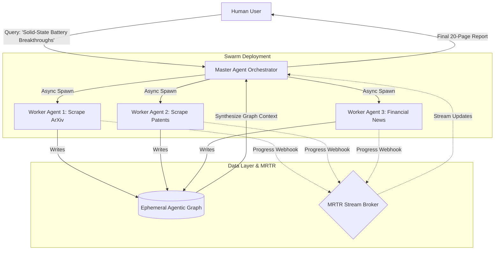

# 03. Capstone 3: Distributed Multi-Agent Scientific Research Swarm

## The Master Architecture



## Project Overview

In this final capstone, we will synthesize all concepts from **Phase 19, 20, and 21** to build the ultimate 2026 application: a **Distributed Multi-Agent Scientific Research Swarm**.

This architecture represents the pinnacle of AI Engineering. It handles long-horizon tasks (hours or days), utilizes massive context scaling via Jamba-2, constructs its own Agentic Knowledge Graph on the fly, and uses MRTR webhooks to prevent HTTP blocking.

### Core Requirements

1.  **Swarm Orchestration**: The Master Agent parses a complex prompt and dynamically spawns *N* Worker Agents concurrently.
2.  **Asynchronous Webhooks**: Workers execute long-running stateless MCP tools (scraping, parsing) using HTTP 202 Async handoffs.
3.  **Agentic Graph Construction**: Workers write the entities they discover (Authors, Patents, Companies) into a shared Ephemeral Temporal Graph.
4.  **Synthesis**: Once all workers finish, the Master Agent traverses the newly built Graph using Jamba-2's massive context window to write a deeply reasoned report.

## Implementation: The Swarm Orchestrator

Below is the implementation using Python for the agentic reasoning and orchestration.

```python
import asyncio
import httpx
# Simulated 2026 AI SDKs
from gpt6_sdk import AstraClient
from jamba_sdk import JambaClient
from hgmem_rs import EphemeralGraph # Rust-backed in-memory graph
from fastapi import FastAPI, Request

# 1. Initialize the Event Broker to receive webhooks from the workers
app = FastAPI()
job_statuses = {}
event_condition = asyncio.Condition()

@app.post("/webhook/worker_update")
async def receive_worker_update(req: Request):
    data = await req.json()
    job_id = data["job_id"]
    job_statuses[job_id] = data["status"]
    
    print(f"[MRTR Broker] Received update for Job {job_id}: {data['status']}")
    
    # Notify the orchestrator that an update occurred
    async with event_condition:
        event_condition.notify_all()
    
    return {"status": "received"}

# 2. The Master Swarm Orchestrator
class ResearchSwarm:
    def __init__(self):
        # We use Astra for reasoning and planning
        self.planner_llm = AstraClient(model="gpt-6-astra")
        # We use Jamba-2 for massive context synthesis at the end
        self.synthesizer_llm = JambaClient(model="jamba-2-huge")
        
        # Initialize an empty, ephemeral graph for this specific research session
        self.session_graph = EphemeralGraph()

    async def execute_research_mission(self, topic: str):
        print(f"[Master] Planning swarm deployment for: '{topic}'")
        
        # 1. Plan the sub-tasks
        plan = await self.planner_llm.structured_predict(
            prompt=f"Break this research topic down into 3 distinct, parallel search vectors: {topic}",
            schema={"vectors": [{"agent_role": "string", "search_query": "string"}]}
        )
        
        worker_job_ids = []
        
        # 2. Spawn the Worker Agents Asynchronously
        async with httpx.AsyncClient() as client:
            for vector in plan["vectors"]:
                print(f"[Master] Spawning Worker: {vector['agent_role']}")
                
                # We fire a request to our Stateless MCP cluster. 
                # It returns HTTP 202 Accepted immediately.
                response = await client.post(
                    "https://mcp.enterprise.internal/tools/call_async",
                    json={
                        "params": {
                            "name": "deep_research_agent",
                            "arguments": {"query": vector["search_query"]}
                        },
                        "client_capabilities": {
                            "webhook_callback_url": "http://master-agent:8000/webhook/worker_update"
                        }
                    }
                )
                
                job_id = response.json()["job_id"]
                job_statuses[job_id] = "pending"
                worker_job_ids.append(job_id)
                
        # 3. Wait for all Async Workers to complete via MRTR Webhook signaling
        print("[Master] Workers deployed. Entering sleep state, waiting for webhooks...")
        await self.wait_for_swarm_completion(worker_job_ids)
        
        # 4. Synthesize the Results
        # While the Master slept, the workers wrote their findings directly into the `session_graph`.
        print("[Master] All workers finished. Synthesizing Graph Context...")
        
        # Extract the entire graph to text. Jamba-2 can handle 1M+ tokens effortlessly.
        massive_context = self.session_graph.export_to_markdown()
        
        final_report = await self.synthesizer_llm.generate(
            prompt=f"You are a master scientist. Write a comprehensive report based on the swarm's findings:\n\n{massive_context}"
        )
        
        print("\n--- FINAL SWARM REPORT ---")
        print(final_report)

    async def wait_for_swarm_completion(self, job_ids: list):
        """Suspends the Master Agent until all workers report 'completed'."""
        async with event_condition:
            while True:
                all_done = all(job_statuses.get(jid) == "completed" for jid in job_ids)
                if all_done:
                    break
                await event_condition.wait() # Sleep efficiently without blocking CPU
```

## Running the Capstone

In a production environment, this Python orchestration script runs in a lightweight container. 
1.  The Master Agent sends 3 asynchronous requests to the heavy cluster.
2.  The HTTP connections close immediately.
3.  The Master goes to sleep (`await event_condition.wait()`).
4.  Hours later, as the heavy data-scraping workers finish their tasks and write to the shared Ephemeral Graph, they ping the `/webhook` endpoint.
5.  The Master wakes up, extracts the massive graph data, and uses the Jamba-2 hybrid model to synthesize the final report.

This zero-blocking, horizontally scalable, multi-agent architecture is the definitive blueprint for AI Engineering in late 2026.
